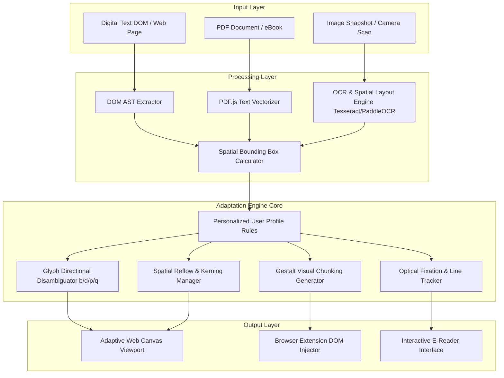

# System Architecture — LexiSight Visual Adaptation System

---

## 🏗️ High-Level System Architecture

LexiSight AI follows a **modular multi-tier pipeline design**, separating raw document/screen ingestion from layout tokenization, visual adaptation rules processing, and real-time DOM/Canvas rendering.



---

## 🔬 Architectural Layers Detailed

### 1. Input Layer
Handles content ingestion across diverse media types:
- **Web DOM Reader**: Captures raw text nodes, font properties, and structural HTML hierarchies from active browser tabs.
- **Document Vectorizer**: Parses structured PDF documents, extracting raw text along with spatial matrix coordinates $(X, Y, W, H)$.
- **Optical Ingestion**: Processes physical text images using client-side or backend OCR pipelines.

### 2. Processing Layer
Tokenizes text while preserving spatial layout coordinates:
- **Spatial Bounding Box Extractor**: Maps individual glyph, word, and line bounding coordinates.
- **Layout AST Generator**: Constructs an Abstract Syntax Tree (AST) representing document structure (headings, paragraphs, columns, list items).
- **Text & Syllable Segmentation**: Breaks words into morphological roots and phonetic syllables for visual chunking.

### 3. Adaptation Engine (Core Cognitive Engine)
Executes real-time visual transformation transformations:

```
                  ┌──────────────────────────────────────────┐
                  │    Personalized User Cognition Profile   │
                  └────────────────────┬─────────────────────┘
                                       │
      ┌────────────────────────────────┼────────────────────────────────┐
      ▼                                ▼                                ▼
┌──────────────┐             ┌──────────────────┐             ┌──────────────────┐
│ Directional  │             │ Spatial Reflow   │             │ Gestalt Color    │
│ Glyph Anchor │             │ & De-crowding    │             │ Chunking Engine  │
├──────────────┤             ├──────────────────┤             ├──────────────────┤
│ Injects visual│            │ Adjusts kerning, │             │ Applies SVG/CSS  │
│ cues on b/d/p│             │ line-height, &   │             │ gradient masks   │
│ orientation  │             │ column width     │             │ to word blocks   │
└──────────────┘             └──────────────────┘             └──────────────────┘
```

- **Directional Glyph Disambiguator**: Intercepts mirrored target characters ($b, d, p, q, m, w$) and applies visual micro-anchors (color accents, stem weight shifts, directional glow dots).
- **Spatial Reflow & Kerning Manager**: Dynamically rescales letter-spacing, word-spacing, and line-height variables in real-time.
- **Gestalt Chunking Engine**: Injects alternating subtle color gradients onto word syllables, promoting whole-word visual recognition.
- **Optical Fixation & Line Tracker**: Renders a dynamic reading bar spotlight and blurs non-focused text blocks.

### 4. Output Layer
Delivers zero-latency visual rendering:
- **Interactive Adaptive Reader (Web SPA)**: High-performance canvas and reflowed HTML container for eBooks, documents, and scanned text.
- **Browser Extension DOM Overlay**: Real-time CSS/JS injection engine that transforms arbitrary web pages in-situ without breaking page layout structure.

---

## ⏱️ Performance & Latency Specifications

| Pipeline Stage | Target Latency | Optimization Tech |
| :--- | :--- | :--- |
| **DOM Parsing & AST Generation** | $< 15\text{ ms}$ | Web Workers + Non-blocking DOM tree traversal |
| **Glyph Micro-Anchor Injection** | $< 10\text{ ms}$ | Regex Tokenizer + CSS Variable / SVG Sprite maps |
| **Spatial Reflow & Geometry Calculation** | $< 16\text{ ms}$ ($60\text{ fps}$) | CSS Grid/Flexbox transform layer + GPU Acceleration |
| **Image OCR & Bounding Box Generation** | $< 800\text{ ms}$ | Quantized WebAssembly Tesseract / WebGPU PaddleOCR |
