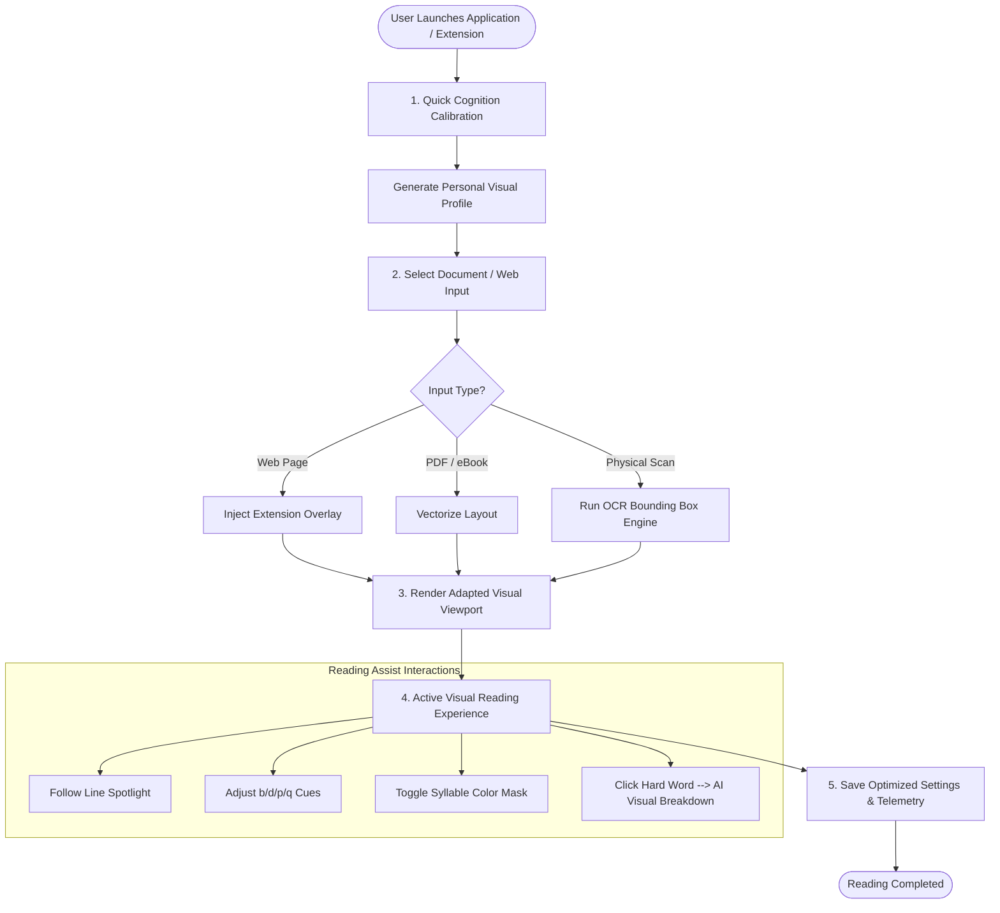

# User Flow & Journey — LexiSight AI

---

## 🗺️ User Experience Blueprint

The LexiSight AI user journey is engineered for **zero friction, immediate cognitive relief, and continuous personalization**.

---

## 🚶 Step-by-Step User Journey

### Step 1: Cognition Profile Calibration (Onboarding)
1. **Initial Access**: The user opens the LexiSight web reader app or activates the Chromium browser extension.
2. **Visual Assessment Test (60 Seconds)**:
   - *Directional Sensitivity*: The user identifies comfortable anchor styles for mirror letters ($b, d, p, q$).
   - *Spatial Crowding Check*: The user adjusts kerning and line spacing sliders until text "stops blurring".
   - *Contrast & Color Palette*: Selects optimal background overlay color (Sepia, Charcoal, Blue, Warm Sand).
3. **Profile Generation**: System saves parameters into a lightweight local JSON profile (`user_visual_profile.json`).

### Step 2: Document Ingestion
The user selects how they want to read:
- **Option A (Web Browsing)**: Click the LexiSight extension icon on any live website (e.g., news site, Wikipedia, LMS).
- **Option B (File Upload)**: Drag and drop a PDF, EPUB, or TXT file into the web reader dashboard.
- **Option C (Camera Snap)**: Take a picture of a physical textbook page using smartphone or webcam.

### Step 3: Real-Time Visual Adaptation
- The system parses the text and applies the user's **Personal Visual Profile**:
  - Mirrored letters receive subtle colored micro-anchors.
  - Spacing dynamically expands (kerning $+20\%$, line height $2.0\times$).
  - Page width constrains to comfortable column boundaries.
  - Line-tracking spotlight activates.

### Step 4: Interactive Assistive Reading
- **Line Tracking**: As the user moves their pointer or scrolls, the active reading spotlight follows, dimming surrounding text.
- **Syllables & Gestalts**: Hovering over long words highlights root syllable structures.
- **AI Visual Breakdown**: Clicking a complex word opens an inline visual card showing an icon, simple definition, and phonetic/visual chunking.

### Step 5: Profile Fine-Tuning & Telemetry
- The user can adjust anchor intensity or spacing at any point via a floating accessibility toolbar.
- The system saves reading speed and fixation pause metrics to optimize profile settings over time.

---

## 📱 User Interface Touchpoints Matrix

| Interaction Screen | Primary Action | User Effort | Output |
| :--- | :--- | :--- | :--- |
| **Calibration Modal** | Select preferred visual anchors & background tint | 30–60 seconds | Personal Visual Profile JSON |
| **Main Viewport** | Scroll, read, and track text | Zero friction | Transformed, anti-crowded visual layout |
| **Floating Assist Toolbar** | Toggle anchors, line height, AI explainer | 1 click | Instant visual layout shift |
| **AI Word Inspector Card** | Click ambiguous or complex word | 1 click | Popover showing syllable breakdown & visual graphic |
